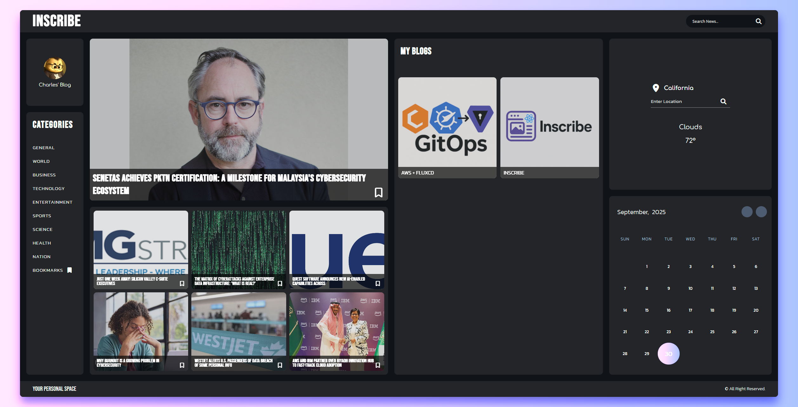

# Inscribe

[](https://gitlab.com/astryx-labs/Inscribe/-/commits/main)
[](https://reactjs.org/)
[](https://vitejs.dev/)
[](LICENSE)
[](https://nodejs.org/)
[](https://eslint.org/)
[](#features)
[](#api-integration)

A comprehensive React application demonstrating modern web development patterns including API integration, state management, and responsive design.



## Overview

Inscribe is a feature-rich web application built with React and Vite that showcases essential modern web development concepts. The application provides a news aggregation platform with blogging capabilities, user interaction features, and responsive design principles.

## Features

### Core Functionality

- **API Data Fetching**: Seamless integration with external APIs to retrieve and display real-time news content
- **State Management**: Efficient application state handling for dynamic data updates and user interactions
- **User Interactions**: Interactive UI components that respond to user inputs and provide engaging experiences
- **Search Functionality**: Advanced search capabilities enabling users to find specific news articles and blog posts
- **Content Organization**: Category-based content organization with bookmarking functionality for user favorites
- **Blog Management**: Complete CRUD operations for user-generated blog posts (Create, Read, Update, Delete)
- **Responsive Design**: Mobile-first design approach ensuring optimal user experience across all device types

### Technical Features

- **News Feed**: Real-time news article aggregation and display
- **Weather Integration**: Current weather information and forecasts
- **Calendar Component**: Interactive calendar for scheduling and event management
- **Category Filtering**: Organized content browsing by categories (Technology, Sports, Health, Entertainment, etc.)
- **Bookmark System**: User-friendly bookmarking for saving favorite articles
- **Search Engine**: Powerful search functionality across all content types

## Technology Stack

- **Frontend Framework**: React 18.x
- **Build Tool**: Vite
- **Styling**: CSS3 with responsive design principles
- **Code Quality**: ESLint for code linting and consistency
- **Development**: Hot Module Replacement (HMR) for enhanced development experience

## Project Structure

```text
src/
├── components/          # Reusable UI components
│   ├── Calendar.jsx    # Calendar functionality
│   ├── News.jsx        # News feed component
│   └── Weather.jsx     # Weather information display
├── assets/             # Static assets and images
│   └── images/         # Application images and icons
├── App.jsx             # Main application component
├── main.jsx            # Application entry point
└── index.css           # Global styles
```

## Getting Started

### Prerequisites

- Node.js (version 16.x or higher)
- npm or yarn package manager
- GNews.io API key (required for news data fetching)

### API Configuration

This application requires a GNews.io API key to fetch news data. Follow these steps to set up your API key:

1. Visit [GNews.io](https://gnews.io/) and create a free account
2. Generate your API key from the dashboard
3. Create a `.env` file in the root directory of the project
4. Add your API key to the `.env` file:

   ```env
   VITE_GNEWS_API_KEY=your_api_key_here
   ```

**Important**: Never commit your `.env` file to version control. The `.env` file should be added to `.gitignore`.

### Installation

1. Clone the repository:

   ```bash
   git clone [repository-url]
   cd Inscribe
   ```

2. Install dependencies:

   ```bash
   npm install
   ```

3. Configure your API key (see API Configuration section above)

4. Start the development server:

   ```bash
   npm run dev
   ```

5. Open your browser and navigate to `http://localhost:5173`

### Available Scripts

- `npm run dev` - Start development server with HMR
- `npm run build` - Build production-ready application
- `npm run preview` - Preview production build locally
- `npm run lint` - Run ESLint for code quality checks

## Development Guidelines

### Code Quality

This project uses ESLint for maintaining code quality and consistency. The configuration includes:

- React-specific rules for best practices
- Modern JavaScript standards (ES2022+)
- Accessibility guidelines
- Performance optimization patterns

### Component Architecture

- **Functional Components**: All components are built using React functional components with hooks
- **Props Validation**: PropTypes or TypeScript interfaces for component props
- **Separation of Concerns**: Clear separation between UI components and business logic
- **Reusability**: Components designed for maximum reusability across the application

### Styling Guidelines

- **CSS Modules**: Component-specific styling to prevent conflicts
- **Responsive Design**: Mobile-first approach with flexible grid systems
- **Performance**: Optimized CSS for fast loading and rendering

## API Integration

The application demonstrates various API integration patterns:

- **GNews.io Integration**: Uses GNews.io API for fetching real-time news articles and content
- RESTful API consumption
- Error handling and loading states
- Data caching strategies
- Real-time data updates

### GNews.io API Features

- Access to thousands of news sources worldwide
- Real-time news article fetching
- Category-based news filtering
- Search functionality across news content
- Rate limiting and quota management

## Browser Support

- Chrome (latest)
- Firefox (latest)
- Safari (latest)
- Edge (latest)

## Contributing

1. Fork the repository
2. Create a feature branch (`git checkout -b feature/amazing-feature`)
3. Commit your changes (`git commit -m 'Add some amazing feature'`)
4. Push to the branch (`git push origin feature/amazing-feature`)
5. Open a Pull Request

## License

This project is licensed under the MIT License - see the LICENSE file for details.

## Acknowledgments

- Built with [React](https://reactjs.org/) and [Vite](https://vitejs.dev/)
- Uses [@vitejs/plugin-react](https://github.com/vitejs/vite-plugin-react) for Fast Refresh
- Follows modern React development patterns and best practices
